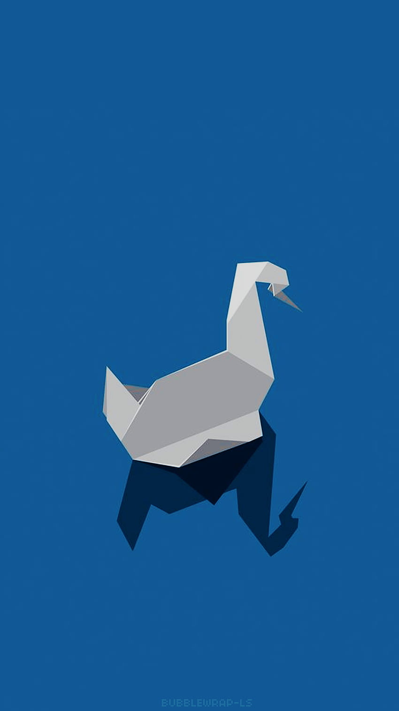

# MostWantedFugitives




# Description
<p>
This project aims to extract the fugitives information via selenium from 
<a>www.terorarananlar.pol.tr</a>. The project contains three different image. The first image is the scraper itself 
navigates through the link and extracts and saves it into the Redis database which is the second image. Lastly,
if the fugitive not inside the Redis database, the server image will receive the image and send it via RabbitMQ.
</p>

# Table of Contents

- [Usage](#usage)
- [Future Improvement](#future-improvement)

# Usage
To run the project, you need to have git, docker and docker-compose installed on your machine. 
Then, you can run the following commands to start the project.

```bash
git clone https://github.com/saricaBugrahan/MostWantedFugitives
cd MostWantedFugitives
docker-compose up --build
```


# Future Improvement

The project can be improved in the following ways:
 - The project can be extended to scrape other websites as well.
 - The scraper image will be called via cronjob to scrape the website periodically.
 - RabbitMQ will not be set as local docker image when the server is ready.
 - Structure will be improved
